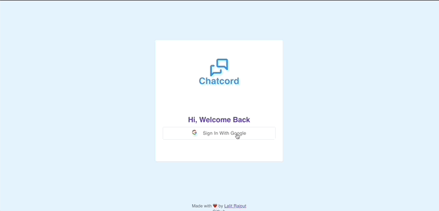
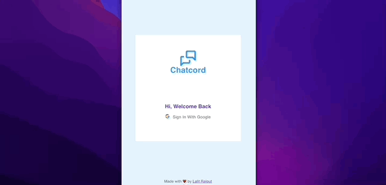
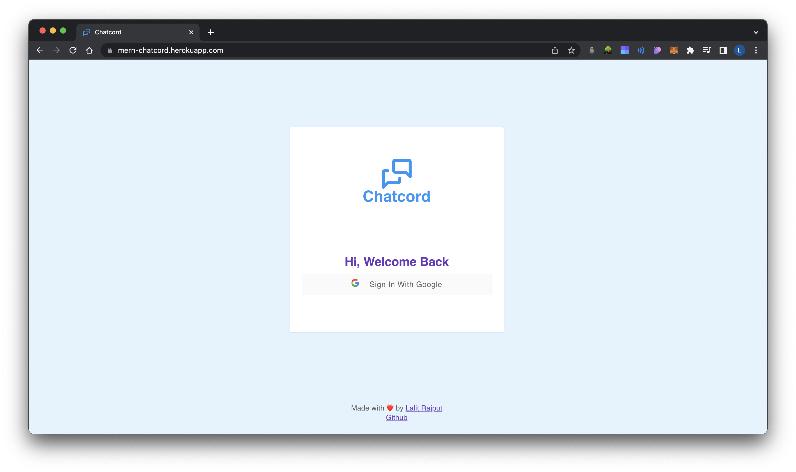
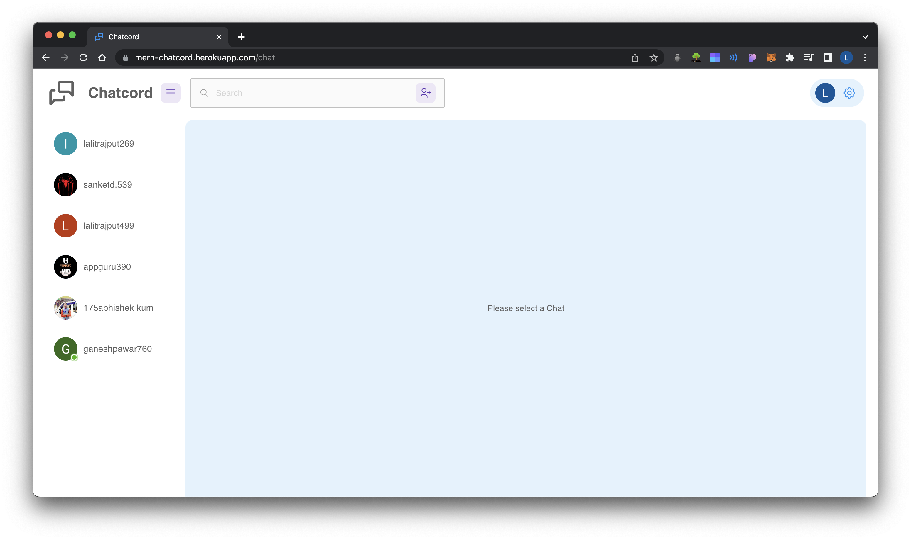
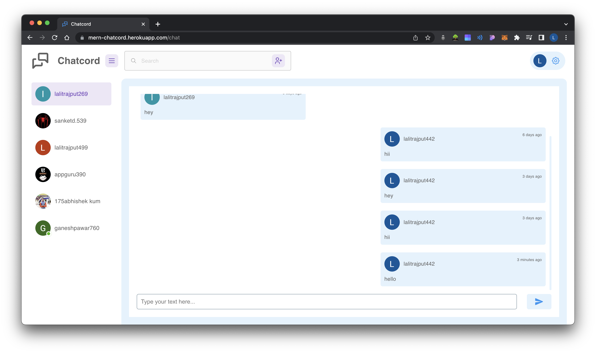
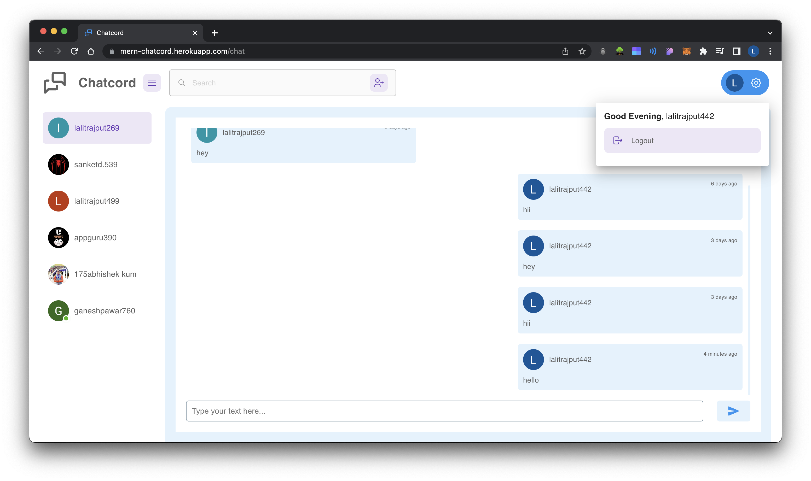

# Chatcord

A Fully fledged Web Chat Application. [Live Website](https://chatcordapp.netlify.app/)

## Tech Stack

**Client:** React, Material UI

**Server:** Node, Express, SocketIO

**Database**: MongoDB


## Features

- Login with Google
- Add Friends
- Live Chatting
- Emoji Sharing
- Responsive Design

## Demo 
Desktop Demo



Mobile Demo



## Screenshots

**Desktop View**





**Mobile View**


## Instructions

- You can use Login with Google feature to get pass through boring procedure of creating and validating your account.

- You can add your friends and chat with them.

- You can share Emojis while chatting.

- You can see the online mark on friends if they are online.

## Run Locally

Clone the project

```bash
  gh repo clone L-A-L-I-T/mernchatcord
```

Folder Structure    
```bash
mernchatcord
 ├──  client
 └──  server
```

Go to the project directory

```bash
  cd mernchatcord
```


Install dependencies

```bash
  npm install
```

Start the server

```bash
  npm start
```

Configuring Client Side

```bash
  cd client
```


Install dependencies

```bash
  npm install
```

Start the client server

```bash
  npm start
```


## Environment Variables

To run this project, you will need to create two .env files, one in  `/mernchatcord/`  folder

`MONGODBURL="Your Mongodb URL"`

In order for login with google to work you need to create your auth credentials on google console.

`GOOGLE_CLIENT_ID="Your google client id"`
`GOOGLE_CLIENT_SECRET="Your client Secret"`

Now you need to create one more .env file in `mernchatcord/client/` folder and add the following

`REACT_APP_SERVERURL="localhost:8000"`


## Deployment

There are many ways to deploy a full stack web application but for this app i have used heroku to deploy the whole app.

Before Deploying You need to make sure that `cors` and `dotenv` packages are installed in your app.

So if you are deploying using heroku, you need to create `Procfile` in `/mernchatcord` directory and add the following code

```bash
web: node server/server.js
```
You also need to change the following code in `package.json` in `/mernchatcord` folder 
```bash
"scripts": {
    "start": "node server/server.js",
    "heroku-postbuild": "NPM_CONFIG_PRODUCTION=false npm install --prefix client && npm run build --prefix client"
  },
```

You also need to add following code in .env file in `/mernchatcord` folder

```bash
NODE_ENV="production
```

You also need to create a build of your client side
```bash
cd mernchatcord/client
npm run build
```

You can follow the following resource for deployment of  [full stack app using heroku.](https://dev.to/hawacodes/deploying-a-mern-app-with-heroku-3km7)


## Authors

- [@LalitRajput](https://www.lalitrajput.com/)


## Other projects

Here are some of my other projects

[Blockchain Based Ecommerce App](https://github.com/L-A-L-I-T/BlockChainEcommerce)

[Moviesverse](https://github.com/L-A-L-I-T/Moviesverse)


## Coding Profile

[Leetcode](https://leetcode.com/lrrajput2001/)

[GFG](https://auth.geeksforgeeks.org/user/lalitrajput/profile)

[Codestudio](https://www.codingninjas.com/codestudio/profile/9563d97f-6e86-483c-85c4-196c5ca5baa3)

[Hackerrank](https://www.hackerrank.com/lrrajput2001)

## 🔗 Links
[](https://www.lalitrajput.com/)
[](https://www.linkedin.com/in/lalit-rajput-9a1a37215/)
[](https://twitter.com/LalitNandkisho1)


## 🛠 Skills
**Languages:** HTML, CSS, Javascript

**Frontend Frameworks:** ReactJs

**Backend Frameworks:** NodeJs, ExpressJs

**Database:** MYSQL, MONGODB


## Feedback

If you have any feedback, please reach out to me at lalitrajput201@gmail.com

